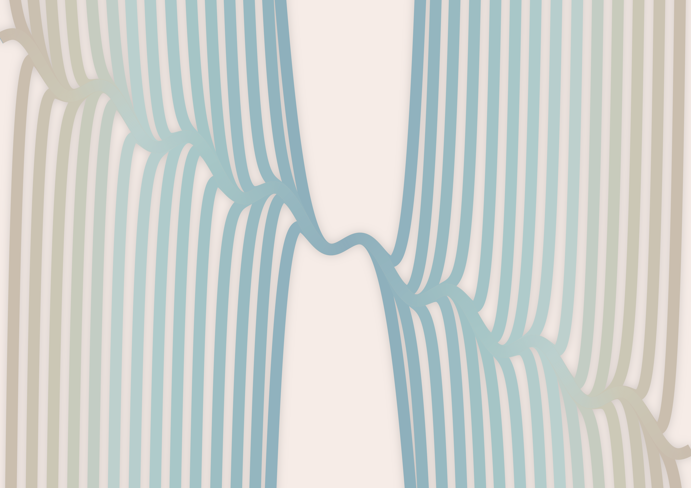
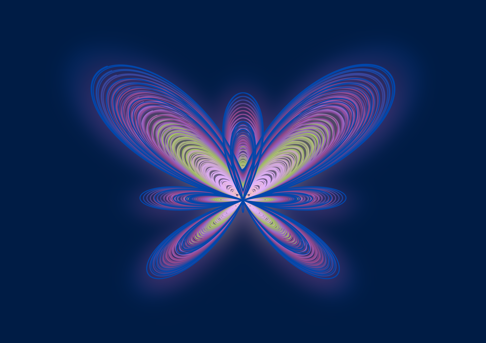
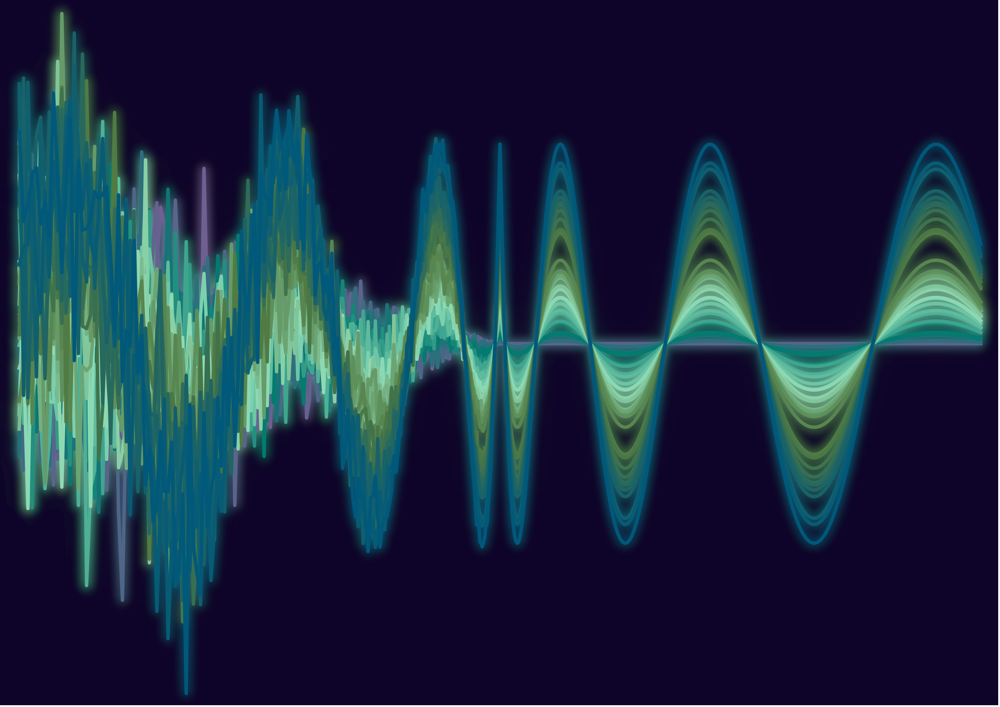
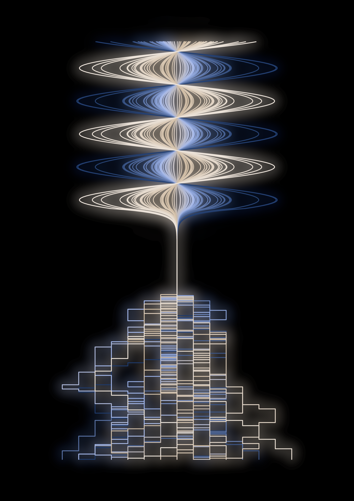
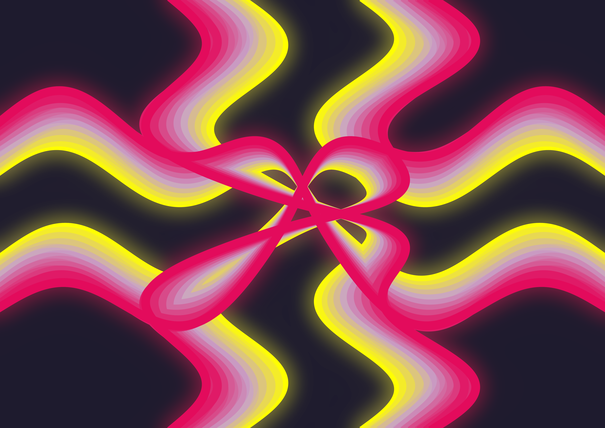

# GraphArt

A small personal project to create art from graphs in Matplotlib! This project contains a collection of artistic visualizations created using mathematical functions and custom plotting techniques.

The graphs were originally made as personalized artworks for friends, each tailored to their favourite colours, and how I perceive their character and my relationship to them. 

## Gallery

<table>
  <tr>
    <td align="center">
      <br/>
      <b>Taylor Series Expansion</b><br/>
      <sub>for Jil</sub>
      <details>
        <summary>Read more</summary>
        <p>Jil is one of the sweetest, sociable people I know, that never fails to connect people to each other. As I learned in my econometrics studies, the Taylor Expansion is a mathematical technique to rewrite functions as infinite series. When visually representing this by using a sine-wave as a function, it results in a beautiful series of curves that come together into one cohesive form, much like the way Jil connects people with her warm and inviting personality.</p>
        <p><strong>Colours used:</strong></p>
        <ul>
          <li>Shade 1</li>
          <li>Shade 2</li>
          <li>Shade 3</li>
          <li>Shade 4</li>
          <li>Shade 5</li>
          <li>Shade 6</li>
          <li>Background</li>
        </ul>
      </details>
    </td>
    <td align="center">
      <br/>
      <b>Parametric Butterfly</b><br/>
      <sub>for Victoria</sub>
      <details>
        <summary>Read more</summary>
        <p>Victoria's idea was easy, as she loves butterflies. However, besides that, I wanted to capture her grace, beauty, and alignment with nature, as well as her vibrant personality.</p>
        <p><strong>Colours used:</strong></p>
        <ul>
          <li>Soft Pink</li>
          <li>Mauve</li>
          <li>Lilac</li>
          <li>Matcha Green</li>
          <li>Amethyst</li>
          <li>Plum</li>
          <li>Cobalt Blue</li>
        </ul>
      </details>
    </td>
  </tr>
  <tr>
    <td align="center">
      <br/>
      <b>Fractal Tree</b><br/>
      <sub>for Max</sub>
      <details>
        <summary>Read more</summary>
        <p>Besides that Max is tall as a tree (at 2m tall), I wanted to capture his strength, assertiveness and steadfastness with this symbol. Max is a reliable and loyal friend, and is never scared to raise his voice if something misaligns with his values.</p>
        <p><strong>Colours used:</strong></p>
        <ul>
          <li>Pink</li>
          <li>White</li>
          <li>Ocher Yellow</li>
          <li>Background</li>
        </ul>
      </details>
    </td>
    <td align="center">
      <br/>
      <b>Symmetric Noisewaves</b><br/>
      <sub>for Taro</sub>
      <details>
        <summary>Read more</summary>
        <p>For Taro, I wanted something that reflected both his calm, composed, and stoic nature, as well as his driven, creative and (sometimes) chaotic side. The symmetric noisewaves represent this duality, with the noisy side representing creativity and the smooth side representing calmness.</p>
        <p><strong>Colours used:</strong></p>
        <ul>
          <li>Cosmic Purple</li>
          <li>Pine Green</li>
          <li>Algae Green</li>
          <li>Fern Green</li>
          <li>Deep Ocean Blue</li>
          <li>Background</li>
        </ul>
      </details>
    </td>
  </tr>
  <tr>
    <td align="center">
      <br/>
      <b>Step Sine & Random Walk</b><br/>
      <sub>for Victor</sub>
      <details>
        <summary>Read more</summary>
        <p>For Victor, I wanted something to capture both his spiritual depth, as well as his orderly and grounded way of dealing with life. The blocky, random walk at the bottom represents his structured approach, while the sine waves at the top represent his more free-spirited side.</p>
        <p><strong>Colours used:</strong></p>
        <ul>
          <li>Night</li>
          <li>Sky Blue</li>
          <li>Sand</li>
          <li>Ivory</li>
          <li>Background</li>
        </ul>
      </details>
    </td>
    <td align="center">
      <br/>
      <b>Warped Sine Waves</b><br/>
      <sub>for Gvantsa</sub>
      <details>
        <summary>Read more</summary>
        <p>Gvantsa is bold, graceful and loves to dance. The warped sine waves reflect her dynamic personality and fluid movements.</p>
        <p><strong>Colours used:</strong></p>
        <ul>
          <li>Yellow</li>
          <li>Raspberry Pink</li>
          <li>Lilac Purple</li>
          <li>Background</li>
        </ul>
      </details>
    </td>
  </tr>
</table>

## Project Structure

```
GraphArt/
├── src/
│   ├── __init__.py
│   ├── plots/                  # Plot generation functions
│   │   ├── __init__.py
│   │   ├── gvantsa_plot.py    # Warped sine wave visualization
│   │   ├── jil_plot.py        # Taylor series expansion plot
│   │   ├── max_plot.py        # Fractal tree visualization
│   │   ├── taro_plot.py       # Symmetric noisewave patterns
│   │   ├── victor_plot.py     # Step sine with random walk
│   │   └── victoria_plot.py   # Parametric butterfly curve
│   └── utils/                  # Shared utilities
│       ├── __init__.py
│       ├── colors.py          # Color palettes
│       └── functions.py       # Utility functions
├── notebooks/
│   └── main.ipynb             # Main exploration notebook
├── outputs/                    # Generated artwork
│   ├── images/
│   └── source_files/          # GIMP source files (.xcf)
├── requirements.txt
└── README.md

### Available Plot Functions

- **`warp_plot`**: Creates warped sine wave patterns with artistic transformations
- **`taylor_expansion_plot`**: Visualizes Taylor series approximations of sine waves
- **`tree_plot`**: Generates fractal tree structures with branching patterns
- **`noisewave_plot`**: Creates symmetric wave patterns with controlled noise
- **`step_sine_plot`**: Combines sine waves with stepped random walks
- **`butterfly_plot`**: Renders parametric butterfly curves

## Utilities

The `src.utils` module provides:

- **`create_cmap(color_1, color_2, length)`**: Create a gradient between two colors
- **`create_multi_cmap(colors, length)`**: Create a gradient from multiple colors
- **`show_colors(colors, title)`**: Display a color palette
- **`colored_line(...)`**: Plot lines with color gradients
- **`LANDSCAPE_DIMENSIONS`**: Standard landscape canvas size (4961/300 × 3508/300)
- **`PORTRAIT_DIMENSIONS`**: Standard portrait canvas size (3508/300 × 4961/300)

## Output

All generated artwork is saved to the `outputs/` directory:
- PNG exports go to `outputs/images/`
- GIMP source files (.xcf) are stored in `outputs/source_files/`

## License

Personal project - feel free to use and modify as you like!
 
